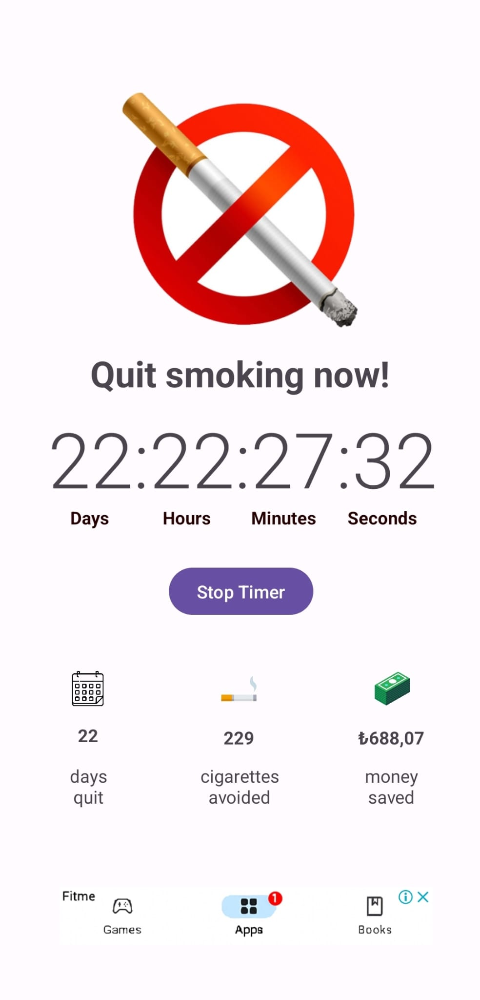
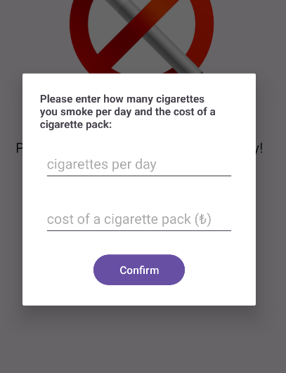

#  Quit Smoking App 

Welcome to the Quit Smoking App! This app helps you quit smoking by tracking your progress and showing your achievements.

## Features

- **Timer**: Tracks how long it has been since you quit smoking.
-  **Money Saved**: Shows how much money you have saved based on your smoking habits.
-  **Cigarettes Avoided**: Shows the number of cigarettes you haven't smoked since quitting.
-  **Days Quit**: Tracks the number of days since you quit smoking.
- **Advertisements**: Displays ads to support app development.

## Screenshots




## Usage

1. **Start the App**: On the first launch, enter your smoking habits (cigarettes per day and cost per pack).
2. **Start Timer**: Click the "Start Timer" button to begin tracking your quit journey.
3. **View Progress**: See your progress, including time quit, money saved, cigarettes avoided, and days quit.
4. **Stop Timer**: To stop the timer, click the "Stop Timer" button and confirm.

## Development

### Code Structure

- `MainActivity.java`: Main activity with the core functionality.
- `activity_main.xml`: Layout file for the main screen.
- `custom_dialog.xml`: Layout file for the initial input dialog.

### Ad Integration

The app uses Google AdMob for ads. Ensure you have the following dependencies in your `build.gradle` file:

```groovy
dependencies {
    implementation 'com.google.android.gms:play-services-ads:20.6.0'
}
